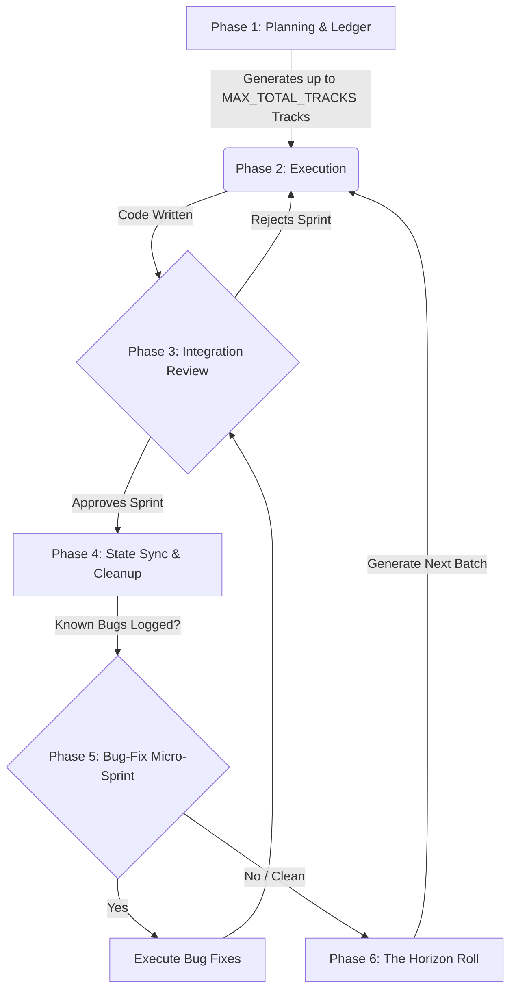

# Multi-Agent AI Orchestration Workflow

Welcome to the AI Software Factory. This repository is orchestrated by a highly modular, multi-agent `.claude` framework.

This guide explains how to use the agents to plan, execute, review, and document massive features without causing "ripple effects," token bloat, or `fsWrite` JSON payload crashes.

---

## 1. The Cast (Personas)

Instead of using one generic AI, you must instruct the AI to adopt a specific persona from the `.claude/personas/` directory before every prompt.

1. **`product_architect`**: The Planner. Interrogates ideas, maintains the Master Ledger (`epic_backlog.md`), and generates sprints of up to `MAX_FEATURE_TRACKS` feature tracks + `MAX_ADMIN_TRACKS` admin tracks in `active_task.md` (see `.claude/rules/01-global-master-rules.md` for constants).
2. **`frontend_architect`**: The Frontend UI Expert. Confined strictly to the frontend domain as mapped in `CLAUDE.md` (e.g., `/frontend`).
3. **`backend_engineer`**: The Backend API Expert. Confined strictly to the backend domain as mapped in `CLAUDE.md` (e.g., `/backend`).
4. **`internal_tooling_engineer`**: The DX Expert. Confined strictly to `/services`.
5. **`devops_qa_engineer`**: The Infrastructure & QA Specialist. Manages Docker, CI, deployment scripts, and end-to-end verification.
6. **`integration_reviewer`**: The Guard. Checks git diffs to ensure no API contracts or downstream dependencies were broken.
7. **`knowledge_manager`**: The Librarian. Curates documentation, checks off completed tasks in the Master Ledger, and asks for explicit human approval.

---

## 2. The Folder Structure (The AI's Brain)

The system relies on strict compartmentalization. Agents only read what they need to know.

- **`CLAUDE.md`** (Root): The Global Dispatcher.
- **`.claude/rules/ & /personas/`**: The system guardrails and AI prompt templates.
- **`[service]/.claude/local_context.md`**: The specific tech stack rules for that folder.
- **`.claude/docs/tasks/epics/`**: The Master Ledgers. High-level bullet points tracking progress out of 100%.
- **`.claude/docs/tasks/active_task.md`**: The current Sprint Backlog (Short-term RAM, up to `MAX_TOTAL_TRACKS` tracks — see `.claude/rules/01-global-master-rules.md`).
- **`.claude/docs/reviews/`**: The staging area where agents leave documentation drafts for human approval.
- **`.claude/docs/core/api-contracts/`**: The "Bridge" where frontend and backend negotiate JSON structures.

---

## 3. Workflow Visualization

## 4. The Universal / Generic Prompt Template

Whenever you start a new chat window, use this fill-in-the-blank template to ensure the agent inherits strict boundaries, regardless of what phase you are in.

> *"Adopt the `[insert_persona]` persona. You are executing `[Track Number / Task Name]` defined in `[Path to file, e.g., active_task.md]`.
> **Objective:** `[Brief 1-sentence goal]`.
> **Guardrails:** Do not skip your mandatory checklist. If you hit a cross-service mismatch, stop and route to `issues.md`. Prove your work with passing test outputs before marking this complete."*

---

## 5. The "Rolling Horizon" Workflow

To build a massive feature (e.g., a 76-task epic), you must execute this 6-Phase loop. **Never generate all detailed tasks at once.**

### Phase 1: Planning & The Master Ledger

Start a planning session with the Architect to establish boundaries.

**Prompt:**

> *"Adopt the `product_architect` persona. I want to build [describe feature]. Scan the codebase. Give me pros/cons, ask clarifying questions."*

**Action:** After answering its questions, tell it:

> *"Approved. Generate the Master Ledger in `.claude/docs/tasks/epics/[feature_name]_backlog.md` with all high-level tasks as unchecked boxes. Then, generate the detailed checklists for ONLY the first batch (up to `MAX_FEATURE_TRACKS` feature tracks + `MAX_ADMIN_TRACKS` admin tracks) in `.claude/docs/tasks/active_task.md`."*

### Phase 2: Execution (The Developer Tracks)

Open the generated `active_task.md`. Open a **fresh chat window** for each track to prevent context bleeding.

**Prompt (Example for Track 1):**

> *"Adopt the `backend_engineer` persona. Execute Track 1 in `.claude/docs/tasks/active_task.md`. **Crucial: Do not skip the Mandatory Checklist.** If you hit a contract mismatch, STOP, update `/.claude/docs/core/api-contracts/`, and route to `issues.md`. Show me your test outputs. You **MUST** end by writing your State Sync Draft to `.claude/docs/reviews/track-[N]-[persona]-sync.md`"*

**Action:** Monitor the checklist. Ensure tests pass before marking complete. Repeat for the up to `MAX_FEATURE_TRACKS` developer tracks.

### Phase 3: Integration Review (The Blast Radius Guard)

Ensure the developers didn't silently break each other's work.

**Prompt:**

> *"Adopt the `integration_reviewer` persona. Review the changes made in this sprint. Cross-reference the backend schema models with the frontend validation schemas (as defined in each service's `local_context.md`) and the API contract. Reject the sprint if there is a mismatch."*

**Action:** If rejected, feed the report back to the developer agents.

#### **In case of rejection:**

##### Step 1: Assign the Patch (The Fixer Track)

Open a **fresh chat window** to prevent the context from getting confused, and send the developer agent in to fix its own mess.

**Copy/Paste this prompt:**

> *"Adopt the `[assigned_persona]` persona. The current sprint was REJECTED by the Integration Reviewer. Read Issue #[N] in `.claude/docs/issues/issues.md` and the `.claude/docs/phase2-integration-report.md`. You failed to [behavior that regressed] in `[file being fixed]`, which broke [downstream consumer].*
> *Your task: Fix [behavior that regressed] in `[file being fixed]`. Run your test suite. Prove to me it is fixed."*

> **Worked example:** See `.claude/examples/case-study-chuchube-rejection.md` for a concrete instance of this pattern.

##### Step 2: The Re-Validation (The Guard Track)

Once the assigned persona applies the fix and shows you passing tests, you must bring the guard back to verify it. Open another  **fresh chat window** .

**Copy/Paste this prompt:**

> *"Adopt the `integration_reviewer` persona. The `[assigned_persona]` has applied a patch for Issue #[N] in `[file being fixed]`. Re-evaluate the sprint. Check if [behavior that regressed] is resolved and if [downstream consumer] is now functioning correctly. If everything passes, formally approve the sprint so we can proceed to cleanup."*

##### Step 3: Resume the Standard Workflow

If the Integration Reviewer gives you the green light and approves the sprint, the blockage is cleared.

You can now proceed exactly as you normally would:

1. Open a fresh chat.
2. Adopt the `knowledge_manager` persona.
3. Tell it to execute the final cleanup track (summarize changes, ask for your approval, squash the history, archive Issue #[N], and check off the items in the `epic_backlog.md`).

### Phase 4: State Sync & Ledger Checkoff (The Librarian)

The developers have left "State Sync Drafts" in `.claude/docs/reviews/`. It is time to finalize the sprint.

**Prompt:**

> *"Adopt the `knowledge_manager` persona. Execute the final track. Review drafts in `.claude/docs/reviews/`. Summarize proposed architectural changes and HALT to ask for my approval. Once approved, update the codebase docs, squash the history,  **and check off the completed tracks as [x] in the `epic_backlog.md` Master Ledger.** "*

**Action:** Reply "Approved" when prompted.

### Phase 5: Handling Bugs & Technical Debt (The Micro-Sprint)

When a sprint finishes, the Knowledge Manager or Integration Reviewer may log "Known Issues" or non-blocking bugs in `.claude/docs/issues/issues.md`. **Do not ask the current agents to fix them.** Their context windows are bloated with the previous feature's code, and they will hallucinate or trigger a failure loop.

You must "Flush the RAM" and execute a Bug-Fix Micro-Sprint:

**Step 1: Lock in the Progress**
Accept the sprint as-is. Tell the Knowledge Manager to update the docs with the known bugs logged. This secures your working code.

**Step 2: The Integration Sweep**
Before fixing the known bugs, ensure there are no *unknown* bugs.

> *"Adopt the `integration_reviewer` persona. Phase X just finished. Scan the git diffs, frontend validation schemas, and backend API responses. Verify if there are ANY OTHER contract mismatches besides the ones logged in `.claude/docs/issues/issues.md`."*

**Step 3: Trigger the Bug-Fix Micro-Sprint**
Open a fresh chat and command the Product Architect to generate a targeted sprint strictly for the technical debt.

> *"Adopt the `product_architect` persona. Before we move to the next phase of the Epic, we must clear our technical debt. Read `.claude/docs/issues/issues.md`. Analyze the codebase to see why these are failing. Give me pros/cons on how to fix them. Once we agree, generate a Bug-Fix micro-sprint into `active_task.md`."*

**Step 4: Execute**
Execute the Bug-Fix sprint using fresh developer agents. Because their context windows are empty and focused *only* on the bugs, they will fix them instantly without breaking the rest of the feature.

### Phase 6: The Horizon Roll (Continuing to the Next Sprint)

Once Phase 4 (and optionally Phase 5) is complete, your `active_task.md` is purged and the AI has forgotten what comes next. You must wake up the Product Architect to read the *actual, freshly-built code* and generate the next sprint.

**Prompt (Example: Starting Sprint 2):**

> *"Adopt the `product_architect` persona. The previous sprint is complete and the Master Ledger has been updated. Read the current, real-world state of the codebase and the `.claude/docs/tasks/epics/[feature_name]_backlog.md` file. Generate the detailed checklists for the NEXT batch of pending tracks into a fresh `.claude/docs/tasks/active_task.md`. Strictly adhere to the Sprint Math: up to `MAX_FEATURE_TRACKS` feature tracks + `MAX_ADMIN_TRACKS` mandatory admin tracks (Integration Reviewer + Knowledge Manager). See `.claude/rules/01-global-master-rules.md` for the authoritative constants."*

**Action:** 1. The Architect reads the codebase to understand the new reality.
2. It finds the next `[ ]` unchecked items in the epic backlog.
3. It generates a new `active_task.md` for the next sprint.
4. Loop back to Phase 2 and repeat until the Epic is 100% complete.

---

## 6. Golden Rules for the Human Director

1. **The Sprint Track Limit:** Never ask an agent to generate more than `MAX_TOTAL_TRACKS` total tracks per sprint (`MAX_FEATURE_TRACKS` coding tracks + `MAX_ADMIN_TRACKS` admin tracks — see `.claude/rules/01-global-master-rules.md`). Massive Markdown/JSON payloads will crash the autonomous editor's `fsWrite` tools and cause infinite failure loops.
2. **The API Contract Bridge:** If building a full-stack feature, the Frontend agent must define the JSON schema in `/.claude/docs/core/api-contracts/`  *first* . The Backend agent must build its backend API routes to fulfill it perfectly.
3. **Never Reuse Chat Windows:** Every track requires a new context window. A Frontend agent must not read the Backend agent's Python code, or it will start hallucinating syntax.
4. **Enforce the TDD Checkbox:** If an agent says "Task Complete" but does not show you the passing output of the project test suite as defined in your service's `local_context.md` (e.g., pytest / vitest / cargo test / go test / npm test), reject their output.
